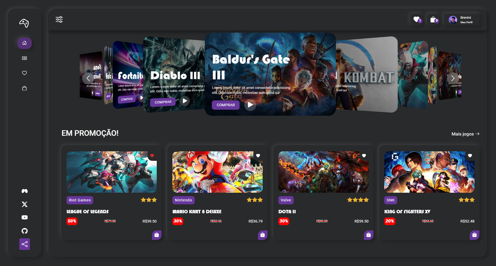

# Brenini Game Hub - Loja Fictícia de Jogos em React

Bem-vindo ao Brenini Game Hub, a sua loja de jogos online construída com React! Explore uma experiência única de compras com um layout atraente, um tema dark moderno e elementos de neumorfismo. Aqui está o que você pode encontrar nesta loja de jogos fictícia:

## Recursos Principais

### Slider Automático
Desfrute de uma apresentação visual impressionante com nosso slider automático na página inicial, destacando os jogos mais recentes e populares.

### Página de Jogos Iniciais
Navegue pela seleção inicial de jogos em destaque. Encontre títulos emocionantes e descubra novas adições à nossa coleção.

### Adicionar à Biblioteca
Marque seus jogos favoritos clicando no ícone de coração em cada jogo. Construa sua biblioteca pessoal com os títulos que mais ama.

### Adicionar à Sacola
Planeje suas compras adicionando jogos à sua sacola. Basta clicar no ícone da sacola para começar a montar sua coleção de jogos.

### Página de Itens Salvos e Sacola
Acesse facilmente todos os itens salvos na sua biblioteca e visualize os jogos adicionados à sua sacola de compras.

### Todos os Jogos
Explore nossa vasta coleção de jogos. Utilize filtros por categoria ou faça pesquisas por nome para encontrar exatamente o que você procura.

### Screeshot

Divirta-se explorando! 🎮✨
